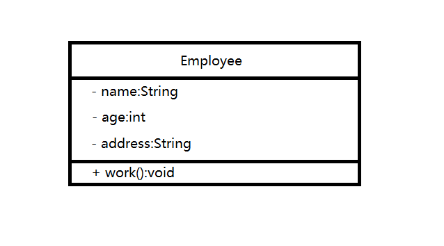

# 2. UML

统一建模语言（Unified Modeling Language）是用来设计软件的可视化建模语言。它的特点是简单、统一、能表达软件中的动态与静态信息。

从目标系统的不同角度出发，定义了用例图、类图、对象图、状态图、互动图、时序图、协作图、构件图、部署图等9种图。

## 2.1 类图概述

类图（Class diagram）是显示了模式的静态结构，特别是模型中存在的类、类的内部以及它们与其他类的关系等。类图不显示暂时性的信息。类图是面向对象建模的主要组成部分。

## 2.2 类图的作用

* 在软件工程中，类图是一种静态的结构图，描述了系统的类的集合，类的属性和类之间的关系，可以简化人们对系统的理解
* 类图是系统分析和设计阶段的重要产物，是系统编码和测试的重要模型

## 2.3 类图表示法

### 2.3.1 类的表示方式

在UML类图中，类使用包含类名、属性和方法且带有分割线的矩形来表示，比如下图表示一个Employee类，它包含name，age和address这3个属性，以及work()方法

属性/方法名称前的+、-号表示了这个属性/方法的可见性，UML类图中表示可见性的符号有三种：

* \+ : 表示public
* \- : 表示private
* \# : 表示protected
* 什么都不加：表示默认（java下表示同包下可见）

属性的完整表示方式是：  **可见性** **名称** ： **类型** [ = 缺省值]

方法的完整表示方式是：  **可见性** **名称(参数列表)** [:返回类型]

***
注意：

1. 中括号中的内容表示是可选的
2. 也有将类型放在变量名前，将返回值放在方法名前的

***

# [返回](./%E7%AC%AC%E4%B8%80%E7%AB%A0.md)