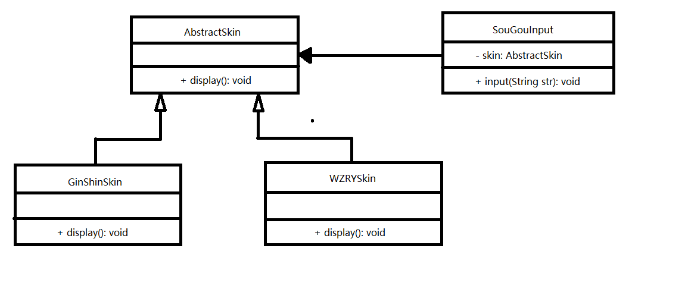

# 3. 软件设计原则

在软件开发中，为了提高软件系统的可维护性和可复用性，增加软件的可扩展性和灵活性，程序员要尽量依据6条原则来开发程序，从而提高软件开发效率、节约开发成本和维护成本。

## 3.1 开闭原则

**对扩展开发，对修改关闭**。在程序需要扩展时，不能去修改原有的代码，实现一个热插拔的效果。简而言之，是为了使程序的扩展性更好，易于维护和升级。

想要达到这样的效果，我们需要使用接口和抽象类。

因为抽象灵活性好，适应性广。只要抽象合理，可以基本保持软件架构的稳定。而软件中易变的细节可以从抽象派生出来的实现类来进行扩展，当软件需要发生改变时，只需要根据需求重新派生一个实现类来扩展即可。

【例】以`开发换肤功能`为例

分析：`换肤功能`是以背景图片，窗口颜色等元素组合的。用户可以根据自己的喜欢去更换自己的输入法皮肤。皮肤的特点有**共同的特点**，可以定义一个抽象类（AbstractSkin），而每个具体的皮肤就是其实现类，如`GinShinSkin`、`WZRYSkin`等。开发时，可以依据AbstractSkin去扩展其他的具体皮肤实现，是满足开闭原则的。

## 3.2 里氏代换原则

**任何基类可以出现的地方，其子类一定可以出现**。通俗的理解：子类可以扩展父类原有的功能，但不能改变父类原有的功能。换句话说，子类继承父类时，除添加新的方法完成新加的功能外，***尽量不要***重写父类的方法。

如果通过重写父类的方法来完成新的功能，这样写起来虽然简单，但是整个继承体系的可复用性会比较差，特别是运用多态比较频繁时，程序出错的概率会变得非常大。

下面来看一个里氏代换原则的经典例子：

【例】正方形不是长方形

在数学领域里，正方形是特殊的长方形。所以我们开发的一个与几何有关的软件系统时，就可以顺利成章地让正方形继承长方形。

# [返回](%E7%AC%AC%E4%B8%80%E7%AB%A0.md)、