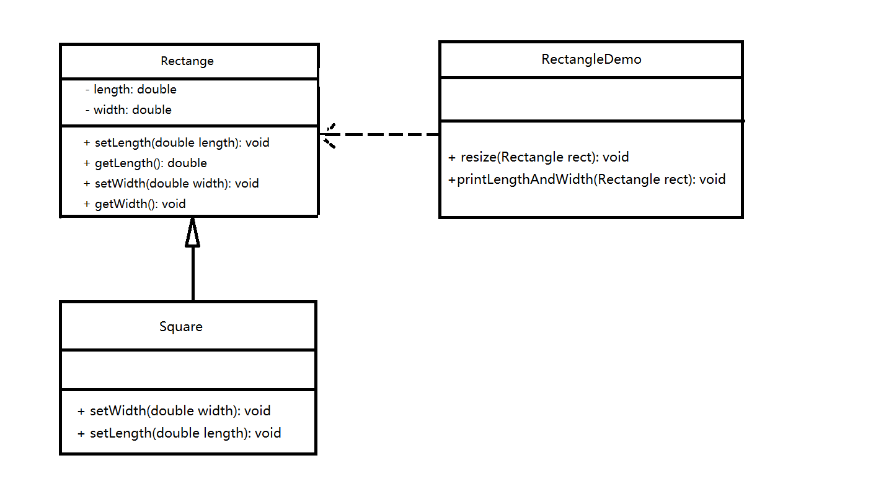
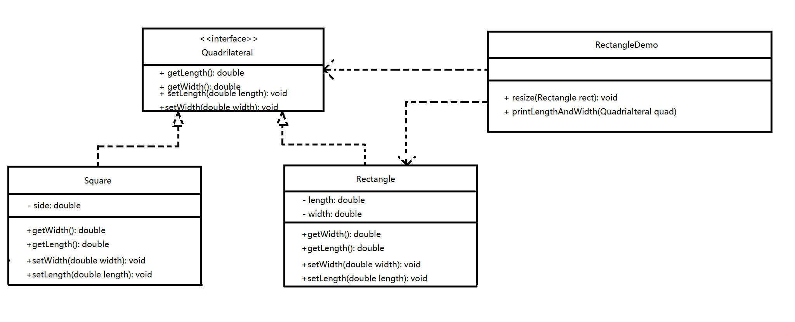

# 3.2 里氏代换原则

**任何基类可以出现的地方，其子类一定可以出现**。通俗的理解：子类可以扩展父类原有的功能，但不能改变父类原有的功能。换句话说，子类继承父类时，除添加新的方法完成新加的功能外，***尽量不要***重写父类的方法。

如果通过重写父类的方法来完成新的功能，这样写起来虽然简单，但是整个继承体系的可复用性会比较差，特别是运用多态比较频繁时，程序出错的概率会变得非常大。

下面来看一个里氏代换原则的经典例子：

【例】正方形不是长方形

在数学领域里，正方形是特殊的长方形。所以我们开发的一个与几何有关的软件系统时，就可以顺利成章地让正方形继承长方形。

在运行了`代码/DesignMode/DesignPolicy/lsp/error`下的`RectangleDemo`代码之后，可以发现，在打印square的长和宽时，程序陷入死循环了。它会一直运行下去，直到发生溢出。

这个例子说明，在`resize`方法中，Rectangle类型是不能被其子类Square直接代替的。因为当参数传入Rectangle能执行的方法能成功时，传入Square却不能得到预期的结果；即子类不能替代父类而出现，也就违反了**里氏代换原则**。

***如何改进呢？***

此时，我们需要重新设计他们之间的关系。抽象出一个**四边形接口`Quadrilateral`**，让`Rectangle`类和`Square`类同时去实现这个`Quadrilateral`接口。如下图所示：

通过执行`代码/DesignMode/DesignPolicy/lsp/correct`下的`RectangleDemo`代码，可以发现，Square已经不能作为参数传入到resize方法当中了，说明此时的Square和Rectangle类已经没有了父子的继承关系，此时就遵循了里氏代换原则。

# [返回](../%E7%AC%AC%E4%B8%80%E7%AB%A0.md)