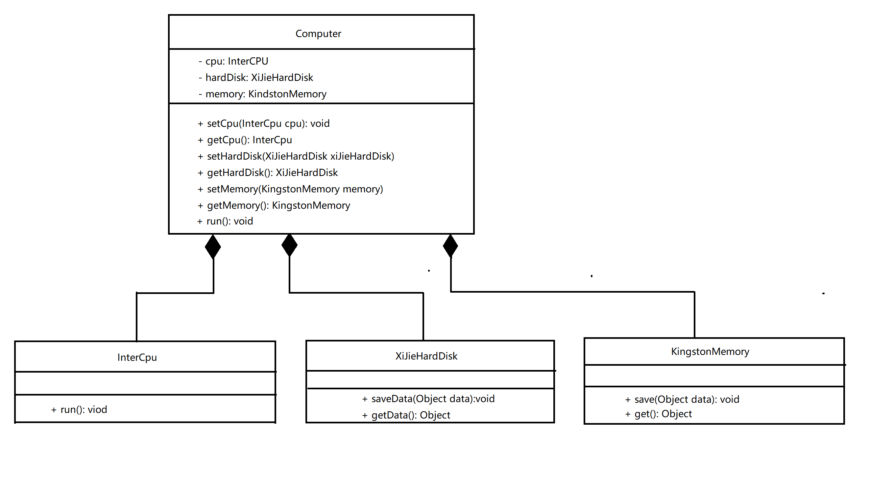
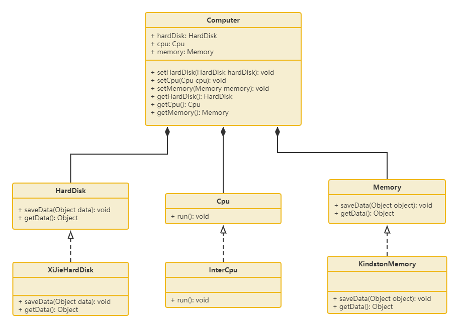

# 3.3 依赖倒转原则

高层模块不应该依赖底层模块，两者都应该依赖其抽象。抽象不应该依赖细节，细节应该依赖抽象。简单的说就是要求对抽象进行编程，不要对实现进行编程，这样就降低了客户与实现模块间的耦合。

也有说法是，依赖倒转原则就是开闭原则的具体实现

【例】组装电脑

现要组装一台电脑，需要配件cpu，硬盘，内存条。只有以上配置都有了，电脑才能正常运行。cpu有很多种选择：Intel、AMD等；硬盘也有很多选择：希捷，西数等；内存条可以选择金士顿，海盗船等等。

类图如下：

阅读`代码/DesignMode/DesignPolicy/dip/error`中的代码可以发现，这份代码确实组装了一个计算机出来，可是计算机中的每一个组件都是固定写死的，无法去切换其他厂商的组件。这对用户而言肯定是不友好的。

下面，我们就可以根据依赖倒转原则去改进这个例子：**让Computer中的各个组件，依赖各自的抽象**，而不是依赖具体的某个实现类。

类图如下：

阅读`代码/DesiginMode/DesignPolicy/dip/correct`中的代码可以发现，`Computer`中的各个组件依赖的都是对应的接口。后续要新接入某个组件时（例子中新增了WWJCpu），就可以让其实现对应的抽象接口即可。`Computer`类就可以直接使用新的实现类，而不用修改自身的代码。

# [返回](../%E7%AC%AC%E4%B8%80%E7%AB%A0.md)