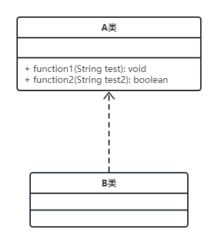
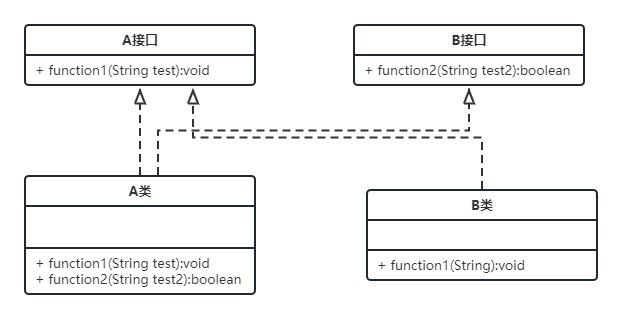

# 3.5 接口隔离原则

客户端不应该被迫依赖于它不使用的方法；一个类对另一个类的依赖应建立在最小接口上。

## 案例示范

### 案例1

如上图类图所示，A类中已经实现了2个方法：function1 和 function2。其中由于 function1 的实现程度较好，B类也想复用。此时可以考虑B类中不复写 function1，而让B类直接继承A类。那么，B类就可以直接调用A类的function1方法了。

**优点在于**：只需要一个继承的关系，就可以简单地让B类拥有 function1 方法。

**问题在于**：B类在获得 function1 的同时，还拥有了 function2。被迫地依赖了这个方法 function2;

***优化思路***

将 function1 和 function2 方法都各自用一个接口去封装，再让需要用到的类去实现即可。如下图所示：

【思考】：如果按照上面的思路，A类、B类不都要实现一遍 function1 了么？

【自己的回答】：function1 方法可以使用一个基类去封装...

# [返回](../%E7%AC%AC%E4%B8%80%E7%AB%A0.md)