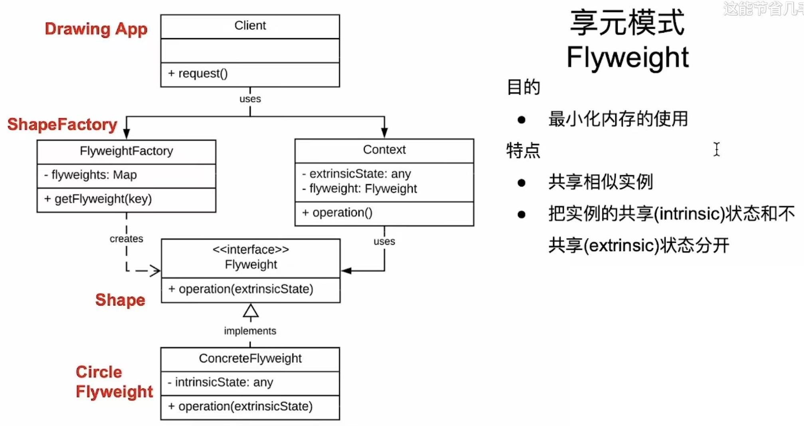

# 享元模式

帮助我们节省内存使用的设计模式

## 入门案例

画图软件：在不同的位置，可以画出任意颜色的图案。

### 代码

```java
/**
 * 该画图软件的基础图案
 **/
public class Circle {
    private String mColor;
    private int x;
    private int y;
    private int mRadius;

    public Circle(String color) {
        mColor = color;
    }

    public void draw() {
        // 画圆的具体实现
    }

    // 省略其他setter代码
}

/**
 * 客户端类
 * */
public class Client {
    public static void main(String[] args) {
        Circle c = new Circle("red");
        c.setX(10);
        c.setY(10);
        c.setRadius(10);
        c.draw();

        Circle c2 = new Circle("blue");
        c2.setX(10);
        c2.setY(10);
        c2.setRadius(10);
        c2.draw();
    }
}
```

### 分析

可以看到，每当我们画出一个圆时，就要new一个Circle的对象出来。对于整个软件而言，这样操作的内存消耗，无疑是非常巨大的。

为了做到节省内存的开销，这里就可以使用享元模式对该代码进行重构。

### 重构后的代码

```java
/**
 * 图形的顶层接口
 * */
public interface Shape {
    void draw(int x, int y, int radius);
}

/**
 * 基于Shape接口实现的Circle类
 **/
public class Circle implements Shape {

    private String mColor;

    public Circle(String color) {
        mColor = color;
    }

    @Override
    public void draw(int x, int y, int radius) {
        // 具体画圆的地方
    } 
}

/**
 * 享元工厂
 **/
public class ShapeFactory {
    private HashMap<String, Shape> mShapeMap = new HashMap();

    public static Shape getShape(String color) {
        Shape shape = mShapeMap.get(color);

        if(shape == null) {
            shape = new Circle(color);
            mShapeMap.put(color, shape);
        }

        return shape;
    }
}

/**
 * 客户端类
 **/
public class Client {
    public static void main(String[] args) {
        Shape redShape = ShapeFactory.getShape("red")
        redShape.draw(10, 20, 5);

        Shape redShape2 = ShapeFactory.getShape("red")
        redShape.draw(5, 6, 7);
    }
}
```

## 享元模式的特点和架构

### 架构



#### 架构中的成员

* FlyWeight(接口) : 是定义**不共享**信息的通用处理方法
* ConcreteFlyWeight : 是FlyWeight接口的具体实现，代表一个具体的共享实例。其包含共享的状态，以及顶层接口定义的方法。
* FlyWeigthFactory : 负责创建享元对象，以保证享元的实例只能被创建一次。若相同的共享状态，已经存在于本工厂的缓存当中，就直接返回现有实例即可。
* Context : 是一个包含了外部状态的类，而这些外部状态是不能够共享的。它通过内部维护的FlyWeight对象进行交互，将外部状态传递给FlayWeight对象，以便于在执行操作时，考虑这些外部状态。

### 目标

最小化资源的使用，优化应用的资源开销

### 特点

* 共享相似的实例
* 把相似的实例通过共享的状态进行缓存，把不能共享的状态设置为由外界传入（如上述例子中的Color可以共享，而x/y/radius不能共享）

## 案例拓展（有Context成员的例子）

一个士兵游戏。包含骑士和弓兵2种兵种，兵种的共有属性是type表示兵种类型，weapon表示武器，armor表示装甲。每个兵种不能共有的属性则是坐标x,y。

* 先抽象出不能共享的行为，作为顶层接口
* 而后实现接口，在实现类中写入可以共享的状态作为成员变量

```java
/**
 * 士兵接口 
 * */
public interface Solider {
    void display(int x, int y);
}

/**
 * 具体士兵的实现，需要写入可以共享的状态
 * */
public class GameSolider implements Solider {

    private String mType;
    private String mWeapon;
    private String mArmor;

    public GameSolider(String type, String weapon, String armor) {
        mType = type;
        mWeapon = weapon;
        mArmor = armor;
    }

    @Override
    public void display(int x, int y) {
        // 具体的展示逻辑实现
    }
}

/**
 * 士兵享元工厂，用于获取Solider对象
 * */
public class SoliderFactory {
    private HashMap<Stirng, GameSolider> mSoliderMap = new HashMap();

    public static GameSolider getSolider(String type, String weapon, String armor) {
        GameSolider solider = mSoliderMap.get(type);

        if (solider == null) {
            Log.d(TAG, "new a GameSolider object");
            solider = new GameSolider(type, weapon, armor);

            mSoliderMap.put(type, solider);
        }

        return solider;
    }
}

/**
 * 享元士兵的Context类，用于管理不能共享的状态
 * */
public class SoliderContext {
    private int x, y;
    private GameSolider mSolider;

    public SoliderContext(GameSolider solider, int x, int y) {
        mSolider = solider;
    }

    public void setX(int x) {
        this.x = x;
    }

    public void setY(int y) {
        this.y = y;
    }

    public void displaySolider() {
        mSolider.display(x, y);
    }
}

/**
 * 客户端类
 * */
public class Client {
    public static void main(String[] args) {
        GameSolider knight = SoliderFactory.getSolider("Knight", "sword", "palte");
        GameSolider archer = SoliderFactory.getSolider("Archar", "bow", "leather");

        SoliderContext knight1 = new SoliderContext(knight, 10, 20);
        SoliderContext knight2 = new SoliderContext(knight, 5, 8);
    
        SoliderContext archer1 = new SoliderContext(archer, 11, 21);
        SoliderContext archer2 = new SoliderContext(archer, 17, 25);

        knight1.displaySolider();
        knight2.displaySolider();
        archer1.displaySolider();
        archer2.displaySolider();
    }
}
```

## 注意事项

### 优点

* 减少内存的使用
* 提高系统的性能
* 可拓展性

### 缺点

* 复杂度增加：区分内外部状态，同时创建享元工厂
* 多线程环境困难（保证状态的同步性，或者状态不可变）
* 适用性有限

### 应用场景

需要用到大量共享数据的地方

1. 文字编辑器和处理器
2. 图形应用
3. 游戏开发

# [返回](./第三章.md)