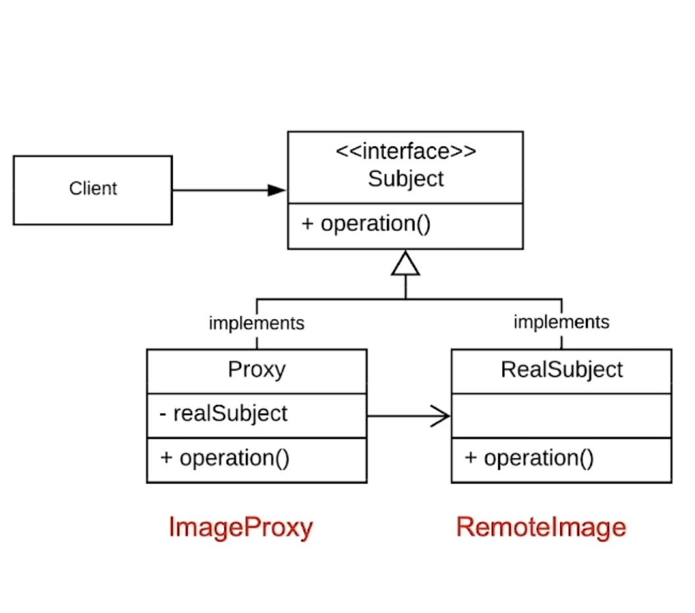

# 代理模式

一个充当中介的设计模式

## 入门案例

背景：开发一个获取网上的图片并展示出来。

### 简单代码

```java
/**
 * 加载图片实体类
 **/
public class RomoteImage {
    private final String mImageUrl;

    public RomoteImage(Stirng url) {
        mImageUrl = url;
    }

    public void loadImage() {
        sout("从" + mImageUrl + "加载图片");
    }
}

/**
 * 客户端
 * */
public class Client {
    public static void main(String[] args) {
        RomoteImage ri = new RomoteImage("https://xxxx");

        ri.loadImage();
    }
}
```

### 分析

代码内容固然简单，但是我们可以发现，加载图片是一个耗时又耗资源的方法。如果同一个url的图片在这个软件系统中多次被加载，那如果每加载一次都new一个RomoteImage的话，系统资源就会被大大浪费。

此时，可以考虑使用一个缓存代理类去使用这个图片加载的功能。

### 改进代码

```java
/**
 * 图片资源类不变
 **/
public class RemoteImage {
    private final String mImageUrl;

    public RemoteImage(String url) {
        mImageUrl = url;
    }

    public void loadImage() {
        sout("加载" + mImageUrl + "的图片");
    }
}

/**
 * 新增一个缓存代理类
 * */
public class RemoteImageCacheProxy {
    private RemoteImage mRI;
    private String mImageUrl;

    public RemoteImageCacheProxy(String url) {
        mImageUrl = url;
    }

    public void loadImage() {
        if (mRI == null) {
            mRI = new RemoteImage(mImageUrl);
        }
        mRI.loadImage();
    }
}

/**
 * 客户端类
 * */
public class Client {
    public static void main(String[] args) {
        RemoteImageCacheProxy proxy = new RemoteImageCacheProxy("https://");
        proxy.loadImage(); // 内部是new一个RemteProxy
        proxy.loadImage(); // 直接使用刚才new的对象进行load
    }
}
```

### 分析

没啥好说的：先把对象的初始化延时到使用的时候，然后在使用对象时，优先使用缓存。

## 代理模式的架构和特点

### 架构



#### 架构成员

* Subject: 定义代理和真实操作都需要的通用方法。是外界交互的入口。
* RealSubject: 被代理的实际对象，是真正处理业务的核心类。一般来说，这个实际对象的创建成本很高，或者说是其需要进行访问的限制。
* Proxy: 负责实现Subject的接口，并且维护对RealSubject的引用。在将请求发送到RealSubject之前/之后，代理类就可以执行附加的操作。比如延迟加载，访问限制，日志，缓存等操作。

### 特点

* 让一个对象（代理）控制对另一个对象的访问（实际需要使用的对象）
* 让代理充当其他事物的接口

### 优势

* 关注点分离
* 提高代码的可维护性

### 不同类型的代理

* 虚拟代理：当实际对象初始化时，需要消耗大量的资源或者时间时。虚拟代理就可以推迟对象创建的过程，在真正需要用到对象时才创建（如例子的改进）
* 缓存代理：用于缓存对象操作结果，提高性能，避免重复计算或者请求（如例子的改进）
* 保护代理（如扩展例子）
* 远程代理
* 智能引用代理

## 拓展案例

背景： 银行账号管理软件。存钱和取钱是只有用户可以操作，理财是只有经理，且用户许可可以操作。

### 文字架构

* 顶层接口： 定义3个方法——存钱、取钱、理财
* 真实账户类： 实现顶层接口，存/取钱都是依据参数+/-余额；理财则是将参数传入的数额转入不可使用的金额
* 代理类：实现顶层接口，依据角色判断对应操作是否可以进行。

### 代码

```java
/**
 * 顶层接口
 * */
public interface BankAccount {
    void putMoney(double money);

    void getMoney(double money);

    void manageMoney(double money);
}

/**
 * 具体实现类
 * */
public class RealBankAccount implements BackAccount {
    private double mBalance = 0; // 余额
    private double mManageMoney = 0; // 理财的钱

    public RealBankAccount(double money) {
        mBalance = money; // 账户的初始资金
    }

    @Override
    public void putMoney(double money) {
        mBalance += money;
    }

    @Override
    public void getMoney(double money) {
        if (mBalance < money) {
            sout("balance is not enough");
            return;
        }

        mBalance -= money;
    }

    @Override
    public void manageMoney(double money) {
        if (mBalance < money) {
            sout("balance is not enough");
            return;
        }

        mManageMoney += money;
        mBalance -= money;
    }

    public double getBalance() {
        return mBalance;
    }
}

/**
 * 代理类
 * */
public class BankAccountProxy implements BankAccount {
    private RealBankAccount mAccount;
    private String mOperatType;

    public BankAccountProxy(RealBankAccount account, String operator) {
        mAccount = account;
        mOpeeratType = operator;
    }

        @Override
    public void putMoney(double money) {
        if (operator.equals("User")) {
            mAccount.putMoney(money);
        }
    }

    @Override
    public void getMoney(double money) {
        if (operator.equals("User")) {
            mAccount.getMoney(money);
        }
    }

    @Override
    public void manageMoney(double money) {
       if (operator.equals("Admin")) {
            mAccount.manageMoney(money);
        }
    }
}

/**
 * 客户端类
 * */
public class Client {
    public static void main(String[] args) {
        RealBankAccount account = new RealBankAccount(100);

        BankAccountProxy proxy = new BankAccountProxy(account, "User");
        proxy.putMoney(200); 
        proxy.getMoney(600);    // 可以执行，但是报余额不足
        proxy.manageMoney(20);  // 不能执行

        BankAccountProxy manageProxy = new BankAccountProxy(account, "Admin");
        manageProxy.putMoney(200);   // 不能执行
        manageProxy.getMoney(600);   // 不能执行
        manageProxy.manageMoney(20); // 可以执行，但是报余额不足
    }
}
```

### 分析

使用代理模式后，我们就可以基于操作者的类型，来控制真实操作账户的访问。很明显，这是一个保护代理模式。

## 模式总结

使用另一个类来对真正要访问的类进行控制。代理为外界的接口。

### 优点

1. 关注点分离：允许将不同类的职责分开，提高代码的可维护性
2. 访问控制： 通过一定程度的保护或者身份验证，来保护对目标对象的访问
3. 延迟实例化： 对于资源密集的对象，代理模式可以帮助我们延迟对象的加载。从而提高应用的性能，降低内存的使用
4. 远程访问： 可以用于表示远程对象，简化和远程资源的交互。隐藏网络通讯的复杂性
5. 缓存： 用于缓存昂贵操作的结果，减少计算，提高性能。
6. 额外的行为： 可以在不修改目标对象的情况下，为其添加额外的功能

### 缺点

1. 增加了系统的复杂度
2. 间接性：加入了非常多中间层，可能会导致调试和理解上的偏差
3. 性能开销 >_>

### 使用的场景

1. 访问控制
2. 缓存代理
3. 保护代理
4. 远程对象
5. 智能引用：管理对象的引用
6. 其他：如日志记录、监控以及审计

# [返回](./第三章.md)