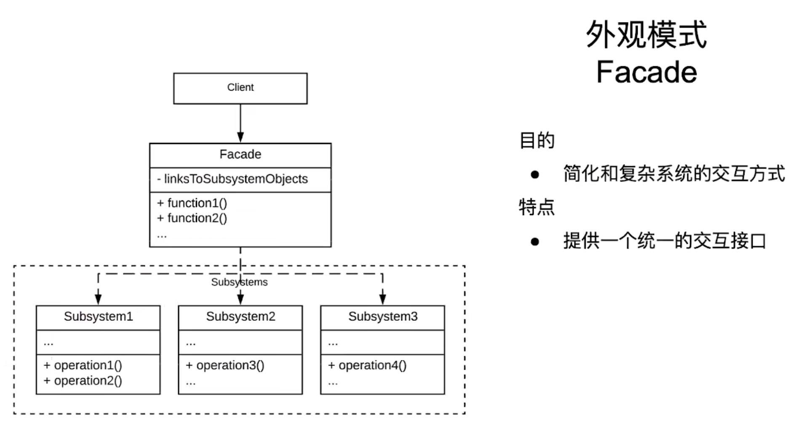

# 外观模式

为复杂系统提供简单接口的模式

## 简单案例

在家中定制一套影院系统，包含音响、投影仪、播放器三个组件。当3个组件同时运作时，就能享受家庭影院了。

### 分析

显然，3个组件单独操作太麻烦了。我们可以把3个组件放到一个封装系统当中，然后提供一个操作的接口。用户直接使用该操作接口对系统进行使用，由封装系统统一操作这3个组件。

### 代码

```java
/**
 * 音响系统
 * */
public class SoudSystem {
    public void play() {
        ...
    }

    public void stop() {
        ...
    }
}

/**
 * 投影仪
 * */
public class Projector {
    public void play() {
        ...
    }

    public void stop() {
        ...
    }
}

/**
 * DVD播放器
 * */
public class DVDPlayer {
    public void play() {
        ...
    }

    public void stop() {
        ...
    }
}

/**
 * 家庭影院系统
 * */
public class FamilyMoviceSystem {
    private SoudSystem mSoudSystem;
    private Projector mProjector;
    private DVDPlayer mDVDPlayer;

    public FamilyMoviceSystem() {
        // 初始化3个组件
    }

    public void play() {
        mSoudSystem.play();
        mPmProjector.play();
        mDVDPlayer.stop();
    }

    public void stop() {
        mSoudSystem.stop();
        mProjector.stop();
        mDVDPlayer.stop();
    }
}

/**
 * 客户端
 * */
public class Client {
    public static void main(String[] args) {
        FamilyMoviceSystem fms = new FamilyMoviceSystem();
        fms.play();
    }
}
```

## 外观模式的特点和架构

### 架构图



### 目标

简化和复杂系统的交互方式

### 特点

提供一个同一个的交互接口

## 注意事项

### 优点

* 简化交互方式
* 解耦合。抽离了客户端和子系统的耦合关系
* 当子系统发生变化时，只需要修改外观类的代码即可。客户端代码无需修改

### 缺点

* 违反了开闭原则
* 隐藏了潜在问题

### 应用场景

* 子系统接口复杂
* 需要将子系统划分为多个层次
* 解耦客户端和子系统
* 具体应用：引入复杂的第三方库，跨平台程序，电商系统等。

# [返回](第三章.md)