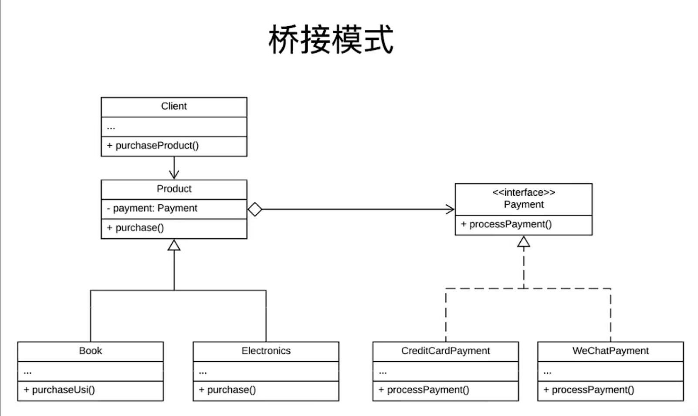

# 桥接模式（双维度模式）

是一种结构型的设计模式，可以将一个大类或者一系列紧密相关的类拆分成**抽象**和**实现**2个独立的层次结构，从而做到在开发中分别使用。

更多的情况是，如何分离一个系统中，明显的2个维度。哪个作为原本定义中的“抽象”的概念，哪个作为原本定义中的“实现”的概念

实际使用场景其实挺少...

## 实例背景

电子商城中，有众多的商品（比如书、电脑等），也有各种付款方式（比如微信、现金等）。书支持微信和现金支付，电脑支持微信、现金和信用卡支付等。在这个例子中，书类中有2个方法：用现金买书和用微信买书；电脑中有3个方法。

很显然，上述的代码，对于商品和支付方式的扩展是非常地不灵活的。比如要增加一个支付宝支付，书也支持支付宝支付，那就要在书类中增加一个支付宝买书的方法。

### 实例总结

这种写法没有扩展性，并且容易引起代码的混乱

## 解决方法：使用桥接模式

前面提到，桥接模式是联系抽象和实现的模式。在上面的例子中，书、电脑等产品就是抽象，微信、支付宝、现金等支付方式就是实现。

代码结构如下图：



### 代码

```java
/**
 * 支付方式接口
 **/
public interface Payment {
    void processPayment();
}

/**
 * 抽象产品类，包含支付方式的一个对象
 **/
public abstract Product {
    protected Payment mPayment;

    public Product(Payment payment) {
        mPayment = payment;
    }

    public abstract void purchase();
}

/**
 * 支付方式具体实现类
 * */
public class WeChatPayment implement Payment {
    @Override
    public void processPayment() {
        sout("WeChat pay");
    }
}

public class CreditCardPayment implements Payment {
    @Override
    public void processPayment() {
        sout("Credite Card pay");
    }
}

/**
 * 具体产品实现类
 **/
public Book extends Product {

    public Book(Payment payment) {
        super(payment);
    }

    @Override
    public void purchase() {
        mPayment.processPayment();
    }
}

public Electronics extends Product {

    public Electronics(Payment payment) {
        super(payment);
    }

    @Override
    public void purchase() {
        mPayment.processPayment();
    }
}

/**
 * 客户端代码
 **/
public void Client {
    public static void main(String[] args) {
        WeChatPayment wcPay = new WeChatPayment();
        CreditCardPayment ccPay = new CreditCardPayment();

        Book book = new Book(wcPay);
        book.purchase();

        Book book2 = new Book(ccPay);
        book2.purchase();
    }
}

```

### 分析

在上述的例子当中，很难说支付方式是商品的某种实现方式，我们不能死脑筋地往概念当中的“实现”的概念去套。我们可以这样理解：电商中的商品是一个维度，商品的购买方式是另一个维度。2个维度可以按照自己的继承树去发展，每个发展出来的子类也都可以相互组合。为了避免这个系统当中的类爆炸，我们就可以使用桥接模式。

在本案例中，产品这个概念对于用户而言，是一个范围，是一个广义，它是这个例子中的抽象；支付方式对于用户而言，是一个摸到的，实际的交互方式，它是这个例子中的实现。（其实也可以反过来去思考它们身份互换后，这个系统的可行性；就会发现只能这样设计）

## 实例背景2：选择礼物

男生追女生，要送礼物。不仅要思考送什么礼物（比如：花、手表这种），还要考虑送什么风格的礼物（比如：恬静的，可爱的，优雅的礼物）。那么，在这个例子当中，花、手表就作为礼物的实现的概念，恬静的、可爱的、优雅的就作为礼物的抽象的概念去设计。

### 代码

```java
/**
 * 礼物的抽象
 **/
public abstract class Gift {
    // 持有礼物的具体实现（以组合的方法）
    protected GiftImp mGiftImp;

    public Gift(GiftImp imp) {
        mGiftImp = imp;
    }

    public abstract Gift packGif();
}

/**
 * 礼物的实现
 **/
public interface GiftImp {
    // 这里就定义一个顶层的抽象接口，没有要实现的方法
    
    String giftName;
}

/**
 * 礼物抽象的具体实现类
 **/ 
public class WarmGift() {
    public WarmGift(GiftImp imp) {
        super(imp);
    }

    @Override
    public Gift packGift() {
        sout("这是一个温暖的" + mGiftImp.getGiftName());
    }
}

/**
 * 礼物实现的具体实现类
 **/
public class Flower implements GiftImp {
    public Flower() {
        giftName = "花";
    }
}

/**
 * 客户端类
 * */
public class Client {
    public static void main(String[] args) {
        Gift gift = new WarmGift(new Flower());
        gift.packGift();
    }
}

```

### 分析

在这个例子中，礼物的风格是一个抽象的概念，礼物的品类就是具体的实现。很好的匹配上了桥接模式的**抽象**以及**实现**的概念。直接套用代码结构图即可。抽象中组合的实现的对象，就是桥接模式中，真正发挥桥接作用的地方。

## 注意事项

### 特点

分离抽象和现实

### 优点

* 让抽象和现实独立
* 灵活和可拓展的架构
* 增加代码复用，可读性以及可维护性
* 简化测试和调试
* 减少了类爆炸的可能

### 缺点

* 增加了系统复杂度
* 需要更多的规划以及设计工作（区分抽象和实现）

### 应用场景

* 隐藏实现的细节
* 避免抽象和实现的绑定
* 提高代码的可拓展性
* 案例：GUI框架，绘图程序，数据库驱动系统

### 和适配器模式的区别

* 适配器模式的作用：将两个不兼容的接口连接起来。也就是已有的代码出现了相互不兼容的情况。
* 把抽象和实现分离，是在架构层面和系统前期的设计就要做好的

# [返回](第三章.md)