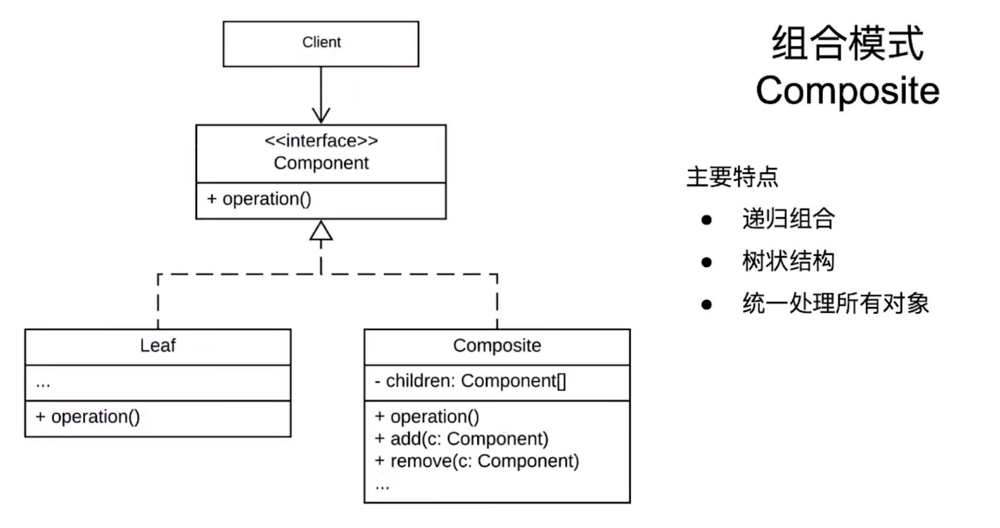

# 组合模式

## 案例背景

一个公司的组织架构从上到下依次是 公司->管理->部门->职员。每个高层次的对象都会管理多个子层级的对象。就有了如下的代码：

### 代码：

```java
/**
 * 公司层级代码
 */
pulic class Company {
  private final List<Manage> mManagList = new ArrayList();

  private final String mCompanyName;

  public Company(String name) {
    mCompanyName = name;
  }

  public void addManage(Manage m) {
    mManagList.add(m);
  }

  public void printMember() {
    for(Manage m: mManagList) {
      m.printName();
    }
  }

  public String printName() {
    sout(this.mCompanyName);
    return this.mCompanyName;
  }
}

/**
 * 管理层级代码
 */
public class Manage {
  private final String mManageName;

  private final List<DepartMent> mDepartMentList = new ArrayList();

  public Manage(String name) {
    mManage = name;
  }

  public void printName() {
    sout(mManageName);
  }

  public void addDepartMent(DepartMent d) {
    mDepartMentList.add(e);
  }

  public void printDepartMent() {
    for(DepartMent d: mDepartMentList) {
      d.printName();
    }
  }
}

/**
 * 部门层级代码
 */
public class DepartMent {
  private final String mDepartMentName;

  private final List<Member> mMemberList = new ArrayList();

  public DepartMent(String name) {
    mDepartMentName = name;
  }

  public void printName() {
    sout(mDepartMentName);
  }

  public void addMember(Member m) {
    mMemberList.add(m);
  }

  public void printMember() {
    for(Member m: mDepartMentName) {
      m.printName();
    }
  }
}

/**
 * 职员层级代码
 */
public class Member {
  private final String mMemberName;

  public Member(String name) {
    mMemberName = name;
  }

  public void printName() {
    sout(mMemberName);
  }
}
```

### 分析

可以看到，每个层级之间的代码差异是非常小的。除了职员层级没有打印子层级信息的方法之外，以上的3个层级都是有打印子层级数据的方法的。

另外，如果使用这份代码维护公司层级。当公司层级发生变化时，比如从 公司->管理->部门->职员 变成 公司->部门->管理->职员。上述代码中的`DepartMent`和`Manage`类就要大改，这就不便于扩展和维护了。

为了改进上述的代码，我们可以使用**组合模式**

## 组合模式改进案例

```java
/**
 * 先定义一个顶层的抽象接口
 **/
public interface Component {
  String printName();
}

/**
 * 公司层级代码
 **/
public class Company implements Component {
  private List<Component> mComponentList;

  private String mCompanyName

  public Company(String name) {
    mCompanyName = name;
    mComponentList = new ArrayList<>();
  }

  @Override
  public String printName() {
    sout(mCompanyName);
    return mCompanyName;
  }

  public void addComponent(Component c) {
    mComponentList.add(c);
  }

  public void printCompany() {
    for(Component component: mComponentList) {
      component.printName();
    }
  }
}

/**
 * 管理层级代码
 **/
public class Manage implements Component {
  private List<Component> mComponentList;

  private String mManageName

  public Manage(String name) {
    mCompanyName = name;
    mComponentList = new ArrayList<>();
  }

  @Override
  public String printName() {
    sout(mManageName);
    return mManageName;
  }

  public void addComponent(Component c) {
    mComponentList.add(c);
  }

  public void printCompany() {
    for(Component component: mComponentList) {
      component.printName();
    }
  }
}

/**
 * 部门层级代码
 **/
public class Department implements Component {
  private List<Component> mComponentList;

  private String mDepartmentName

  public Department(String name) {
    mDepartmentName = name;
    mComponentList = new ArrayList<>();
  }

  @Override
  public String printName() {
    sout(mDepartmentName);
    return mDepartmentName;
  }

  public void addComponent(Component c) {
    mComponentList.add(c);
  }

  public void printCompany() {
    for(Component component: mComponentList) {
      component.printName();
    }
  }
}

/**
 * 职工层级代码
 **/
public class Member implements Component {

  private String mName

  public Department(String name) {
    mName = name;
  }

  @Override
  public String printName() {
    sout(mName);
    return mName;
  }
}

/**
 * 客户端代码 
 **/
public class Client {
  public static void main(String[] args) {
    Company wwjCompany = new Company("wwjCompany");

    Manage wwjManage1 = new Manage("管理1");
    Manage wwjManage2 = new Manage("管理2");
    Manage wwjManage3 = new Manage("管理3");

    wwjCompany.addComponent(wwjManage1);
    wwjCompany.addComponent(wwjManage2);
    wwjCompany.addComponent(wwjManage3);

    // 后面以此类推...
  }
}
```

### 分析

当我们定义了顶层的接口时，每个对象都去继承自这个接口。然后每个高等级的类去管理一个接口的集合。这样，高等级的类可以不管自己维护的集合的具体实现。

抽象成统一接口的同时，还对每个层级进行了解耦。使得层级之间的转换更加的方便。

## 组合模式的特点

提供一个便捷的方法，去管理一个具有层次化的结构。



### 组合模式中的各个角色

* Component:顶层接口，规范了其子类的统一操作。提供统一管理对象的方法
* Leaf：叶子结点。叶子结点不再维护其他的叶子结点作为自己的成员，而是执行具体的业务操作
* Composite:非叶子结点。当中会管理一个实现了顶层接口的对象的集合，往往是对该集合进行管理

## 注意事项

### 组合模式的特点：递归组合，树状结构，统一处理

### 优点

* 简化客户端操作
* 易于扩展

### 缺点

* 可能违反开闭原则

### 应用场景

* 层次结构系统
* 对单个对象和组合对象进行相同的操作

### 注意点

* 确保把组件接口适合叶子结点和组合对象
* **把可选方法放入具体的叶子结点**

# [返回](./第三章.md)