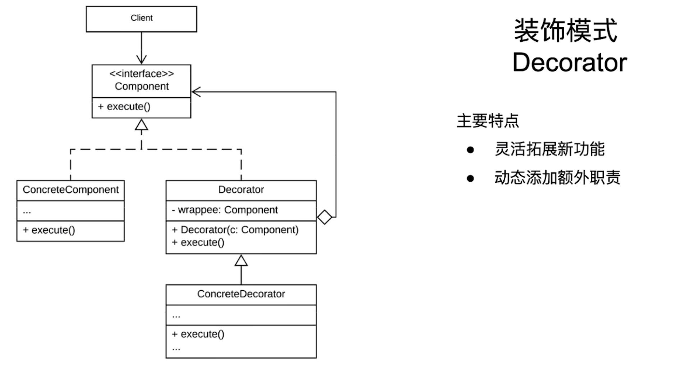
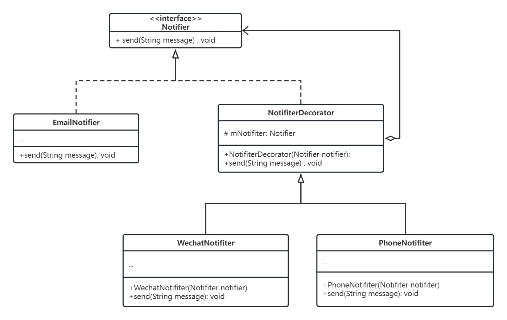

# 装饰模式

一个用于包装具体组件的模式

## 简单案例

咖啡店中的各种咖啡，加入不同的材料，其总价不同。如果说每个子类都单独继承自父类，那么子类的管理就会越发地复杂。此时，可以考虑使用装饰器模式。

### 代码

```java
/**
 * 咖啡的顶层接口
 **/
public interface Coffee {
    double cost();
}

/**
 * 基础款咖啡(2块钱)
 **/
public class BasicCoffee implements Coffee {
    @Override
    public double cost() {
        return 2;
    }
}

/**
 * 咖啡装饰器
 * 
 * 这个所谓的抽象类没有抽象方法，其实目的就是不想被调用者new出来。只想作为父类被继承出来
 **/
public abstract class CoffeeDecorator implement Coffee {

    protected Coffee mCoffee;

    public CoffeeDecorator(Coffee cof) {
        mCoffee = cof;
    }

    public double cost() {
        return mCoffee.cost();
    }
}

/**
 * 牛奶装饰器
 * */
public MilkDecorator extends CoffeeDecorator {
    public MilkDecorator(Coffee c) {
        super(c);
    }

    @Override
    public double cost() {
        return mCoffee.cost() + 2;
    }
}

/**
 * 加糖的装饰器
 * */
public SugarDecorator extends CoffeeDecorator {
    public SugarDecorator(Coffee c) {
        super(c);
    }

    @Override
    public double cost() {
        return mCoffee.cost() + 1;
    }
}

/**
 * 客户端类
 * */
public class Client {
    public static void main(String[] args) {
        BasicCoffee cof = new BasicCoffee();
        sout(cof.cost()); // 2

        MilkDecorator milkCoffee = new MilkDecorator(cof);
        sout(milkCoffee.cost()); // 4

        SugarDecorator sugarCoffee = new SugarDecorator(cof);
        sout(sugarCoffee.cost()); // 3

        SugarDecorator sugarMilkCoffee = new SugarDecorator(milkCoffee);
        sout(sugarMilkCoffee.cost()); // 5
    }
}
```

### 分析

有了上述的装饰器，我们在为咖啡添加配料时，就不需要去继承如此多的类进行管理。每增加一种配料，就只需增加一种装饰器，然后进行套娃的调用即可。（甚至可以实现double milk / sugar 的配料方式，非常的灵活。

rxJava的实现就采用了装饰器模式。

## 模式的特点和架构

### 架构

装饰器模式架构如图



#### 装饰器模式成员及解释

* Component: 定义公共组件，以及装饰器的主要行为
* ConcreteComponent: 实现`Component接`口，表明自己是需要被装饰的对象
* Decorator: 实现`Component`接口，是一个抽象类，是该模式下所有装饰器的父类。为具体的Component(ConcreteComponent)添加新的功能。
* ConcreteDecorator: 继承`Decorator`，实现具体的装饰功能。

### 主要特点

* 灵活地拓展新功能
* 动态添加额外职责

## 拓展案例

公司当中需要搭建一套通讯的系统。最基本的通讯方式是邮件，在基本的邮件通讯之后，外加的还有微信/电话通讯的方式。

代码架构如图：



### 代码
```java
/**
 * 顶层接口
 * */
public interface Notifier {
    void send(String message);
}

/**
 * 基础组件
 * */
public class EmailNotifier implements Notifier {
    @Override
    public void send(String message) {
        sout(message);
    }
}

/**
 * 装饰器父类
 * */
public abstract class NotifierDecorator implements Notifier {

    protected Notifier mNotifier;

    public NotifierDecorator(Notifier notifier) {
        mNotifier = notifier;
    }

    @Override
    public void send(String message) {
        mNotifier.send(message);
    }
}

/**
 * Wechat装饰器
 * */
public class WechatDecorator extends NotifierDecorator {

    public WechatDecorator(Notifier notifier) {
        super(notifier);
    }

    @Override
    public void send(String message) {
        super.send(message);
        sout("WeChat send " + message);
    }
}

/**
 * Phone装饰器
 * */
public class PhoneDecorator extends NotifierDecorator {

    public PhoneDecorator(Notifier notifier) {
        super(notifier);
    }

    @Override
    public void send(String message) {
        super.send(message);
        sout("Phone send " + message);
    }
}

/**
 * 客户端代码
 * */
public class Client {
    public static void main(String[] args) {
        Notifier notifier = new EmailNotifier();

        notifier= new WechatDecorator(notifier);
        notifier = new PhoneDecorator(notifier);

        notifier.send("base message");
        // 打印如下：
        // base message
        // WeChat send base message
        // Phone send base message
    }
}
```

## 注意事项

### 优点

1. 提高了灵活性和可拓展性
2. 为各种的组合方式提供一种便利的方式
3. 增加了可维护性

### 缺点

1. 代码变复杂了
2. 增加性能开销

### 应用场景

* 不影响其他对象的情况下，为单个对象添加新的功能
* 动态组合多种可选功能
* 具体场景：GUI可视化组件，通信协议，日志系统，权限控制系统

## 与相似模式的比较

| 模式       | 目的                                   | 模式架构的主要角色 | 应用场景                   |
| :--------- | :------------------------------------- | :----------------- | :------------------------- |
| 建造者模式 | 分步构建复杂的对象                     | 指挥者、建造者     | 构建具有**复杂结构的对象** |
| 组合模式   | 表示具有层次结构的对象                 | 组合类和叶子结点   | 树形结构和递归结构         |
| 装饰器模式 | 动态添加新的功能，或者不同的功能的组合 | 抽象组件和装饰器   | 功能的**扩展和结合**       |

# [返回](第三章.md)