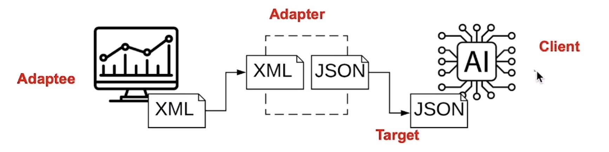
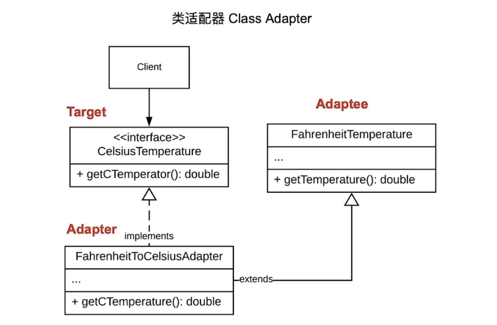
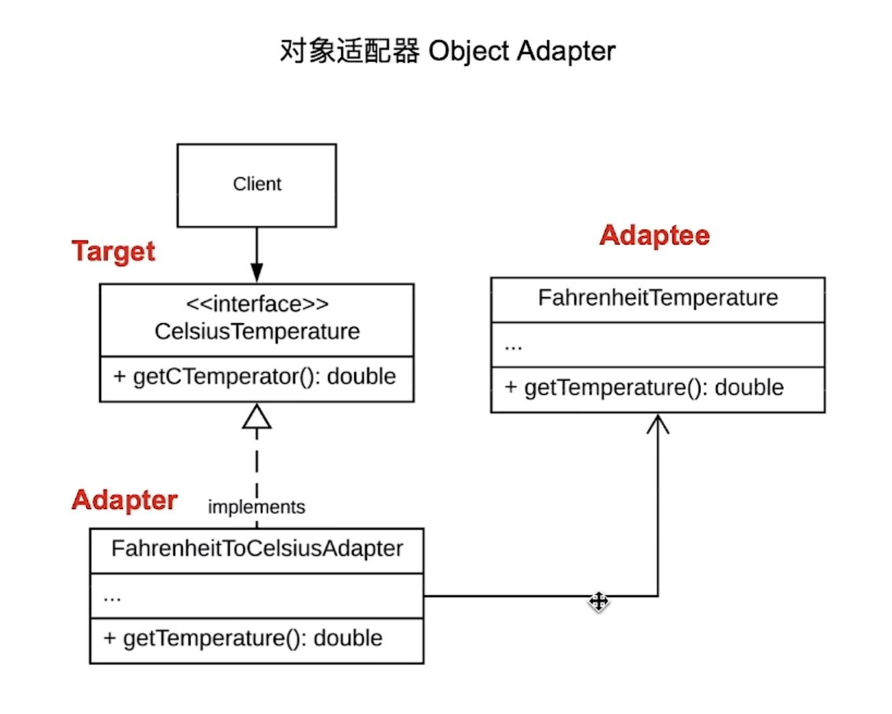

# 适配器模式

## 现实背景示例

当我们去外国出差时，一定要带的，可能包含一个充电转换插头。这个转换插头，即是我们所说的适配器。

## 定义

适配器模式，就是让接口不兼容的对象能够互相合作

## 适配器模式角色

* 请求者Client: 调用服务的角色
* 目标Target：定义了Client要使用的功能（即转换后的结果）
* 转换对象 Adaptee：需要被适配器转换的对象（即转换前的源头）
* 适配器 Adatper：实现转换功能的对象（即做转换的人）



## 适配器实现方法

* 类（Class）适配器模式，使用继承的方法
* 对象（Object）适配器模式，使用组合的方式

## 代码案例: 华氏度转摄氏度

### 类适配器写法

代码结构如图：



#### 基本思路：

**继承被转换类（Adaptee），实现目标类（Target）的接口**

#### 代码

```java
/**
 * 华氏度类，被转化的类（Adaptee）
 **/
public class HuaShiTemperature() {

    private double mHuaShiTemperature;

    public HuaShiTemperature(double temp) {
        mHuaShiTemperature = temp;
    }

    public double getHuaShiTemperature() {
        return mHuaShiTemperature;
    }
}


/**
 * 摄氏度接口 
 **/
public interface SheShiTemperature() {
    double getSheShiTemperature();
}

/**
 * 适配器类
 **/
public HuaShiToSheShiTemperatureAdater extends HuaShiTemperature implements SheShiTemperature {

    public HuaShiToSheShiTemperatureAdater(double huaShiTemp) {
        super(mHuaShiTemperature);
    }

    @Override
    public double getSheShiTemperature() {
        double huaShiTemperature = super.getHuaShiTemperature();
        return (huaShiTemperature - 32) * 5 / 9;
    }
}

/**
 * 客户端代码调用
 **/
public class Client {
    public static void main(String[] args) {
        HuaShiToSheShiTemperatureAdater adapter = new HuaShiToSheShiTemperatureAdater(100);
        adatper.getSheShiTemperature();
    }
}
```

### 对象适配器写法

代码结构如图：



#### 基本思路：

**实现目标（Target）接口，同时将被转换类（Adaptee）的对象组合进自己的成员变量**

#### 代码

```java
/**
 * 华氏度类，被转化的类（Adaptee）
 **/
public class HuaShiTemperature() {

    private double mHuaShiTemperature;

    public HuaShiTemperature(double temp) {
        mHuaShiTemperature = temp;
    }

    public double getHuaShiTemperature() {
        return mHuaShiTemperature;
    }
}


/**
 * 摄氏度接口 
 **/
public interface SheShiTemperature() {
    double getSheShiTemperature();
}

/**
 * 适配器类
 **/
public HuaShiToSheShiTemperatureAdater implements SheShiTemperature {
    private HuaShiTemperature mHuaShiTemp;

    public HuaShiToSheShiTemperatureAdater(HuaShiTemperature huaShiTemp) {
        mHuaShiTemp = huaShiTemp;
    }

    @Override
    public double getSheShiTemperature() {
        double huaShiTemp = mHuaShiTemp.getHuaShiTemperature();
        return (huaShiTemperature - 32) * 5 / 9;
    }
}

/**
 * 客户端代码
 **/
public class Client {
    public static void main(String[] args) {
        HuaShiTemperature huaShi = new HuaShiTemperature(100);
        HuaShiToSheShiTemperatureAdater adapter = new HuaShiToSheShiTemperatureAdater(huaShi);

        adapter.getSheShiTemperature();
    }
}
```

使用对象适配器的方式，adapter和adaptee的耦合关系会降低

## 补充：双向适配器

在上面的例子中，实现摄氏度和华氏度的相互转换

### 代码

```java
/**
 * 摄氏度接口
 **/
public interface CelsiusTemp {
    double getCelsiusTemp();
}

/**
 * 华氏度接口
 **/
public interface FahrenheitTemp {
    double getFahrenheitTemp();
}

/**
 * 摄氏度具体实现类
 **/
public Celsius implements CelsiusTemp {
    private double mTemp;

    public Celsius(double temp) {
        mTemp = temp;
    }

    @Override
    public double getCelsiusTemp() {
        return mTemp;
    }
}

/**
 * 华氏度具体实现类
 **/
public Fahrenheit implements FahrenheitTemp {
    private double mTemp;

    public Fahrenheit(double temp) {
        mTemp = temp;
    }

    @Override
    public double getFahrenheitTemp() {
        return mTemp;
    }
}

/**
 * 适配器
 **/
public class CTFAdapter implements CelsiusTemp, FahrenheitTemp {
    
    private Celsius mCelsius;

    private Fahrenheit mFahrenheit;

    public CTFAdapter(mCelsius celsius) {
        mCelsius = celsius;
        mFahrenheit = new Fahrenheit(celsius.getCelsiusTemp() * 9 / 5 + 32);
    }

    public CTFAdapter(mFahrenheit fahrenheit) {
        mFahrenheit = fahrenheit;
        mCelsius = new Celsius((fahrenheit.getFahrenheitTemp() - 32) * 5 / 9);
    }

    @Override
    public double getCelsiusTemp() {
        return mCelsius.getCelsiusTemp();
    }

    @Override
    public double getFahrenheitTemp() {
        return mFahrenheit.getFahrenheitTemp();
    }

}

/**
 * 客户端调用
 **/
public class Client() {
    public static void main(String[] args) {
        Celsius c = new Celsius(5);
        CTFAdapter adapter1 = new CTFAdapter(c);
        double fTemp = adater1.getFahrenheitTemp();

        Fahrenheit f = new Fahrenheit(100);
        CTFAdapter adapter2 = new CTFAdapter(f);
        double cTemp = adater2.getCelsiusTemp();
    }
}
```
## 注意事项

### 特点

**连接两个不兼容的接口**

### 优点

* 将转换的代码从业务中抽离出来
* 在不修改原有代码的情况下完成转化的工作
* 让代码更加具有模块化，便于复用

### 缺点

* 在设计失误的情况下，代码整体的复杂度会增加
* 重复代码会增多
* debug较难（？）

### 应用场景

* 基本应用：支持多接口，重用现有代码
* 连接遗留代码和新系统
* 连接第三方库
* 单元测试：模拟真正的对象的行为（Mock objects in unit testing）

# [返回](第三章.md)