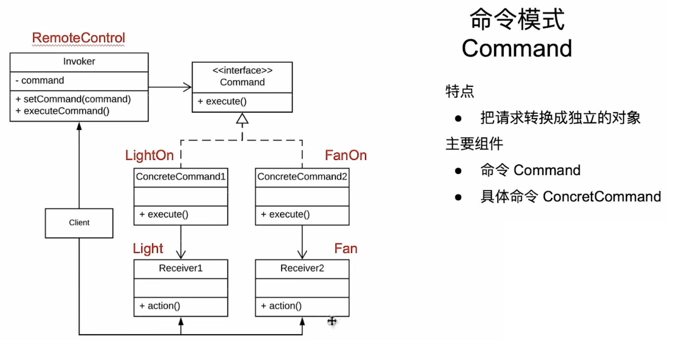

# 命令模式

把请求变成一个单独的对象

## 入门案例

灯泡控制。需要一个控制器，统一操作家中所有的灯。

### 代码

```java
public interface Light {
    void on();
    void off();
}

public class KitchenLight implements Light {
    @Override
    public void on() {
        sout("kitchen light on");
    }

    @Override
    public void off() {
        sout("kitchen light off");
    }
}

public class RoomLight implements Light {
    @Override
    public void on() {
        sout("room light on");
    }

    @Override
    public void off() {
        sout("room light off");
    }
}

/**
 * 客户端代码
 * */
public class Client {
    public static void main(String[] args) {
        RoomLight roomLight = new RoomLight();
        KitchenLight kitchenLight = new KitchenLight();

        roomLight.on();
        kitchenLight.on();
    }
}
```

### 分析

很显然，直接将每个单独的实体暴露在用户面前。耦合度之高，不利于后续对Light的实现的扩展。我们就可以尝试使用命令模式改写这个代码。

### 改进代码1

```java
public interface Light {
    void on();
    void off();
}

public class KitchenLight implements Light {
    @Override
    public void on() {
        sout("kitchen light on");
    }

    @Override
    public void off() {
        sout("kitchen light off");
    }
}

public class RoomLight implements Light {
    @Override
    public void on() {
        sout("room light on");
    }

    @Override
    public void off() {
        sout("room light off");
    }
}
```

灯的具体定义以及实现，都保持和原本案例一致。接下来创建一个命令类Command。

```java
public class Command {
    /**
     * 执行指令
     * */
    void excute();

    /**
     * 回退动作
     * */
    void undo();
}

public class LightOnCommand implements Command {
    private final Light mLight;

    public LightOnCommand(Light light) {
        mLight = light;
    }

    @Override
    public void excute() {
        mLight.on();
    }

    @Override
    public void undo() {
        mLight.off();
    }
} 

public class LightOffCommand implements Command {
    private final Light mLight;

    public LightOffCommand(Light light) {
        mLight = light;
    }

    @Override
    public void excute() {
        mLight.off();
    }

    @Override
    public void undo() {
        mLight.on();
    }
} 
```

然后我们用一个控制器去包装这个指令

```java
public class CommandControler {
    private Command mCommand;

    public void setCommand(Command command) {
        mCommand = command;
    }

    /**
     * 使用执行功能
     * */
    public void pressExcute() {
        if(mCommand != null) {
            mCommand.excute();
        }
    }

    /**
     * 使用回退功能
     * */
    public void pressUndo() {
        if(mCommand != null) {
            mCommand.undo();
        }
    }
}
```

客户端代码

```java
public class Client {
    public static void main(String[] args) {
        KitchenLight kitchenLight = new KitchenLight();
        RoomLight roomLight = new RoomLight();

        LightOnCommand lightOn = new LightOnCommand(kitchenLight);
        LightOffCommand lightOff = new LightOffCommand(roomLight);

        CommandControler controler = new CommandControler();

        controler.setCommand(lightOn);
        controler.pressExcute(); // kitchen light on;
        controler.pressUndo(); // kitchen light off;

        controler.setCommand(lightOff);
        controler.pressExcute(); // room light off;
        controler.pressUndo(); // room light on;
    }
}
```

### 分析2：

嗯？？什么鬼？这不是比原本的调用更加复杂了嘛？要多创建3个对象才能实现我们的功能，这不是更加繁琐了？

其实不然，这对功能的扩展是十分有利的。比如此时，我们的灯增加了一个“增加亮度的功能”，代码如下：

### 改进代码2

```java
public interface Light {
    void on();
    void off();
    void incressLight();
}

public class KitchenLight implements Light {
    @Override
    public void on() {
        sout("kitchen light on");
    }

    @Override
    public void off() {
        sout("kitchen light off");
    }

    @Override
    public void incressLight() {
        sout("kitchen is incressing light");
    }
}

public class RoomLight implements Light {
    @Override
    public void on() {
        sout("room light on");
    }

    @Override
    public void off() {
        sout("room light off");
    }

    
    @Override
    public void incressLight() {
        sout("room is incressing light");
    }
}
```

各种灯的实现都要新增这个“增加亮度”的接口以及实现。此时当我们要调用这个“增加亮度”的功能时，就可以新建一个Command：

```java
public class IncressLightCommand implements Command {
    private final Light mLight;

    public IncressLightCommand(Light light) {
        mLight = light;
    }

    @Override
    public void excute() {
        mLight.incressLight();
    }

    @Override
    public void undo() {
        mLight.off();
    }
}
```

在客户端修改的代码如下：

```java
public class Client {
    public static void main(String[] args) {
        KitchenLight kitchenLight = new KitchenLight();
        RoomLight roomLight = new RoomLight();

        LightOnCommand lightOn = new LightOnCommand(kitchenLight);
        LightOffCommand lightOff = new LightOffCommand(roomLight);

        CommandControler controler = new CommandControler();

        controler.setCommand(lightOn);
        controler.pressExcute(); // kitchen light on;
        controler.pressUndo(); // kitchen light off;

        controler.setCommand(lightOff);
        controler.pressExcute(); // room light off;
        controler.pressUndo(); // room light on;

        // 新增“增加亮度”功能
        IncressLightCommand increLightCommand = new IncressLightCommand(roomLight);
        controler.setCommand(increLightCommand);
        controler.pressExcute(); // room is incressing light;
        controler.pressUndo(); // room light off
    }
}
```

### 分析3

发现了么？客户端要改的代码，仅仅是增加调用“增加亮度”指令这一小部分。原本的代码一点都不影响。甚至，我这个命令模式还能开风扇~

### 改进代码3

```java
public interface Fun {
    void on();
    void off();
    void speed();
}

public class ElectronicFun implements Fun {
    @Override
    public void on() {
        sout("Fun turn on");
    }

    @Override
    public void off() {
        sout("Fun turn off");
    }

    @Override
    public void speed() {
        sout("Fun turn wind speed to height")
    }

}

public class FunOnCommand implements Command {
    private final Fun mFun;

    public FunOnCommand(Fun fun) {
        mFun = fun;
    }

    @Override
    public void excute() {
        mFun.on();
        mFun.speed();
    }

    @Override
    public void undo() {
        mFun.off();
    }
}
```

客户端同样也是只新增几行代码：

```java
public class Client {
    public static void main(String[] args) {
        KitchenLight kitchenLight = new KitchenLight();
        RoomLight roomLight = new RoomLight();

        LightOnCommand lightOn = new LightOnCommand(kitchenLight);
        LightOffCommand lightOff = new LightOffCommand(roomLight);

        CommandControler controler = new CommandControler();

        controler.setCommand(lightOn);
        controler.pressExcute(); // kitchen light on;
        controler.pressUndo(); // kitchen light off;

        controler.setCommand(lightOff);
        controler.pressExcute(); // room light off;
        controler.pressUndo(); // room light on;

        // 新增“增加亮度”功能
        IncressLightCommand increLightCommand = new IncressLightCommand(roomLight);
        controler.setCommand(increLightCommand);
        controler.pressExcute(); // room is incressing light;
        controler.pressUndo(); // room light off

        // 新增风扇
        ElectronicFun electricFun = new ElectronicFun();
        FunOnCommand funOnCommand = new FunOnCommand(electricFun);
        controler.setCommand(funOnCommand);
        controler.pressExcute(); // Fun turn on \n Fun turn wind speed to height
        controler.pressUndo(); // Fun turn off
    }
}
```

### 分析4：

这种扩展方式，真的很省心，不会影响先前的功能和代码。不需要知道底层的实现细节，只需要关注命令的抽象方法即可。

## 命令模式的特点和架构

### 架构



#### 主要的组件

* Command(接口)：声明执行方法的接口
* 具体命令：实现Command接口，持有真正业务逻辑的处理对象（接受者）
* 接受者：真正执行业务逻辑的类
* invoker：是该模式的交互入口，它持有命令对象的引用，同时承担发起命令的动作

### 特点

把请求转换成独立的对象。可以轻松的支持撤销以及重做的功能。同时在增加新的功能时，只需要新增一个命令类并调用即可，不用改动原本的代码

## 总结

### 核心思想

把请求转换为一个单独的类

### 优点

1. 动作封装成对象，可以存储起来以实现撤销和重做的功能
2. 解耦发送者和接受者
3. 扩展性好
4. 简化和集中错误处理
5. 易于实现宏命令和组合命令

### 缺点

1. 代码复杂化
2. 性能开销会有一定的增加

### 应用场景

* 文本编辑器
* 图形编辑器


# [返回](./第四章.md)