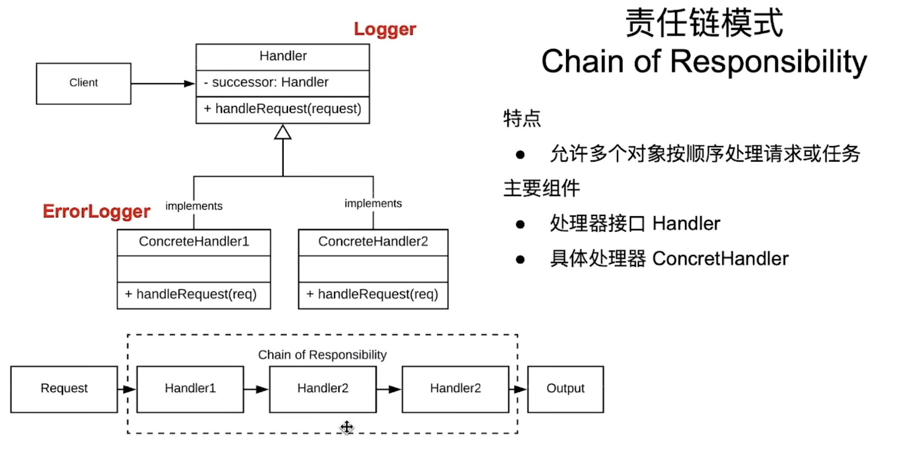

# 职责链模式

一个帮助我们处理请求逻辑顺序的模式

## 入门案例

软件日志。记录不同的日志信息，方便日后复盘分析。日志的类型分为info、debug、error。简单的代码案例如下：

### 代码

```java
public class Logger {
    public static final int ERROR = 1;
    public static final int DEBUG = 2;
    public static final int INFO = 3;

    private final int mLevel;

    public Logger(int level) {
        mLevel = level;
    }

    public void logMessage(int logLevel, String message) {
        if (logLevel == ERROR && logLevel <= mLevel) {
            sout("Error: " + message);
        } else if (logLevel == DEBUG && logLevel <= mLevel) {
            sout("Debug: " + message);
        } else if (logLevel == INFO && logLevel <= mLevel) {
            sout("Info: " + message);
        }
    }
}

/**
 * 客户端代码
 * */
public class Client {
    public static void main(String[] args) {
        Logger log = new Logger(Logger.INFO);

        log.logMessage(Logger.ERROR, "This is an error message");
        log.logMessage(Logger.DEBUG, "This is a debug message");
        log.logMessage(Logger.INFO, "This is an info message");
    }
    // 输出结果是3个都输出出来了
}
```

### 分析

依靠if-else实现的代码。但是后续要添加更多类型的log信息时，if-else的代码就要被修改一次。实际上，这并不利于软件的扩展。此时，我们尝试使用职责链模式来改进这个代码。

### 改进后代码

```java
/**
 * Logger基类
 **/
public abstract class Logger {

    public static final int ERROR = 1;
    public static final int DEBUG = 2;
    public static final int INFO = 3;

    protected final int mLevel;
    protected Logger mNextLogger;

    public Logger(int level) {
        mLevel = level;
    }

    public void setNextLogger(Logger nextLogger) {
        mNextLogger = nextLogger;
    }

    public void printLog(int level, String message) {
        if (level <= mLevel) {
            writeLog(message);
        } else if (mNextLogger != null) {
            mNextLogger.printLog(level, message);
        }
    }

    protected abstract void writeLog(String message);
}

/**
 * Error等级Log类
 **/
public ErrorLog extends Logger {
    public ErrorLog() {
        super(Logger.ERROR);
    }

    @Override
    protected void writeLog(message) {
        sout("Error: " + message);
    }
}

/**
 * Debug等级Log类
 **/
public DebugLog extends Logger {
    public ErrorLog() {
        super(Logger.DEBUG);
    }

    @Override
    protected void writeLog(message) {
        sout("Debug: " + message);
    }
}

/**
 * Info等级Log类
 **/
public InfoLog extends Logger {
    public InfoLog() {
        super(Logger.INFO);
    }

    @Override
    protected void writeLog(message) {
        sout("Info: " + message);
    }
}

/**
 * 客户端类
 * */
public class Client {
    public static void main(String[] args) {
        ErrorLog errorLog = new ErrorLog();
        DebugLog debugLog = new DebugLog();
        InfoLog infoLog = new InfoLog();

        // 构建职责链
        errorLog.setNextLogger(debugLog);
        debugLog.setNextLogger(infoLog);

        errorLog.printLog(Logger.ERROR, "这是一个ErrorLog")；
        errorLog.printLog(Logger.DEBUG, "这是一个DebugLog");
        errorLog.printLog(Logger.INFO, "这是一个InfoLog");
    }
}
```

## 职责链模式的特点和架构

### 架构



### 特点

让多个对象按顺序处理请求或者处理主要任务

### 主要组件

* 处理器接口 Handler : 定义了所有的具体处理所具有的通用方法和属性
* 具体处理其 ConcretHandlers : 实现处理器的各个类。每个类中都持有对下一业务等级的处理器的引用，并负责属于这一业务等级的具体请求。完成不了的请求就抛给下一级。
* 客户端类：负责构筑起职责链的链条，并向链头发送处理请求。

## 扩展案例

取款机。依据传入的总额吐出不同面额的纸币

```java
/**
 * 取款机抽象类
 **/
public abstract Crasher {
    protected double mHandleCrasher;
    protected Crasher mNextCrasherHandler;

    public Crasher(double crash) {
        mHandleCrasher = crash;
    }

    public void setNextCrasherHandler(Crasher crasher) {
        mNextCrasherHandler = crasher;
    }

    public void takeCrash(double money) {
        if (money >= mHandleCrasher) {
            int count = (int) (money / mHandleCrasher);
            System.out.println("take " + count + " " + mHandleCrasher + " money from Money" + mHandleCrasher + "Crasher");
            double lestMoney = money - (count * mHandleCrasher);
            if (mNextCrasherHandler != null) {
                mNextCrasherHandler.takeCrash(lestMoney);
            } else if (lestMoney > 0) {
                System.out.println("there is still " + lestMoney + " can't be take from Money" + mHandleCrasher + "Crasher");
            }
        } else if (mNextCrasherHandler != null) {
            mNextCrasherHandler.takeCrash(money);
        } else {
            System.out.println("Can't take " + money + "crash from Money" + mHandleCrasher + "Crasher");
        }
    }
}

/**
 * 面值为50的取款机的实体类
 * */
public class Money50Crasher {
    public Money50Crasher() {
        super(50);
    }
} 

public class Money20Crasher {
    public Money20Crasher() {
        super(20);
    }
}

public class Money10Crasher {
    public Money10Crasher() {
        super(10);
    }
}

public class Money1Crasher {
    public Money1Crasher() {
        super(1);
    }
}

public class Client {
    public static void main(String[] args) {
        Money50Crasher money50Carsher = new Money50Crasher();
        Money20Crasher money20Carsher = new Money20Crasher();
        Money10Crasher money10Carsher = new Money10Crasher();
        Money1Crasher money1Carsher = new Money1Crasher();

        money50Carsher.setNextCrasherHandler(money20Carsher);
        money20Carsher.setNextCrasherHandler(money10Carsher);
        money10Carsher.setNextCrasherHandler(money1Carsher);

        money50Carsher.takeCrash(220);
    }
}
```

### 分析

其实这个案例还没有入门案例好。因为具体实现类的Handler比如 `Money50Crasher`之类的，对于吐钱的操作都是极其的重复的，导致我将重复代码抽到了抽象类当中。具体的处理类只用实现构造函数，并传入要处理的面值即可。可以看看，但不建议成为范例。

## 优缺点以及应用场景

基本概念：让多个处理器按照顺序处理请求

### 优点

* 分离发送者和接受者，只需要知道责任链头即可
* 可以随意定制责任链中的处理者的顺序
* 易于扩展、维护

### 缺点

* 无法保证一定能处理请求
* 性能开销增加
* debug比较复杂

### 应用场景

* 有多个对象可以处理请求
* 动态添加、修改或者删除请求**处理器**
* 应用：中间件，GUI事件处理，异常处理，工作流（okHttp就是责任链模式的一个范例）

# [返回](第四章.md)