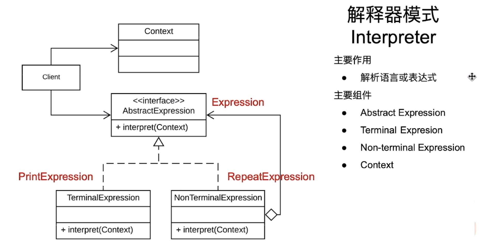

# 解释器模式

一个专门用于处理语言或者解析表达式的设计模式

## 入门案例

解析一个表达式： `Repeat 3 Times: Print Hello`

### 代码

```java
public class Client {
    public static void main(String[] args) {
        String command = "Repeat 3 Times: Print Hello";

        String[] words = command.split(" ");
        if(words[0].equalsIgnoreCase("repeat")) {
            int repeatTime = Integer.parseInt(words[1]);

            for(int i = 0; i < repeatTime; i++) {
                sout(words[4]);
            }
        }
    }
}
```

### 分析

功能非常地专一。不利于拓展。维护性非常差。

### 改进代码

```java
/**
 * 定义抽象表达式接口
 * */
public interface Expression {
    void interpret();
}

/**
 * 打印指令
 **/
public PrintExpression implements Expression {
    private String mMessage;

    public PrintExpression(String message) {
        mMessage = message;
    }

    @Override
    public void interpret() {
        sout(mMessage);
    }
}

/**
 * 重复指令
 * */
public RepeatExpression implements Expression {
    private int mRepeatCount;
    private Expression mExpression;

    public RepeatExpression(int count, Expression expression) {
        mRepeatCount = count;
        mExpression = expression;
    }

    @Override
    public void interpret() {
        for(int i = 0; i < mRepeatCount; i++) {
            mExpression.interpret();
        }
    }
}

/**
 * 客户端
 * */
public class Client {
    public static void main(String[] args) {
        String command = "Repeat 3 Times: Print Hello";

        String[] words = command.split(" ");
        if(word[0].equalIgnoreCase("Repeat")) {
            int count = Integer.parseInt(word[1]);

            PrintExpression pe = new PrintExpression(words[4]);

            RepeatExpression re = new RepeatExpression(count, pe);

            re.interpret();
        }
    }
}

/**
 * 除法解释器
 * 
 * @author AleckWei
 *
 */
public class DeMultExpression implements Expression {

	private final Expression mLeft;

	private final Expression mRight;

	public DeMultExpression(Expression leftExpression, Expression rigthExpression) {
		mLeft = leftExpression;
		mRight = rigthExpression;
	}

	@Override
	public int interact() {
		// TODO Auto-generated method stub
		if (mRight.interact() == 0) {
			throw new RuntimeException("can't pass 0 as 被除数！");
		}

		return mLeft.interact() + mRight.interact();
	}

}

/***
 * 终端解释器，用于存储值
 * 
 * @author AleckWei
 *
 */
public class ValueExpression implements Expression {

	private int mValue;

	public ValueExpression(int value) {
		mValue = value;
	}

	@Override
	public int interact() {
		// TODO Auto-generated method stub
		return mValue;
	}

}

/**
 * 客户端代码
 * 
 * @author AleckWei
 *
 */
public class Client {

	public static void main(String[] args) throws Exception {
		// TODO Auto-generated method stub
		System.out.println("please input your expression, split by ' '.");
		Scanner scanner = new Scanner(System.in);
		String intputString = scanner.nextLine();

		String[] expressionArray = intputString.split(" ");

		Stack<Expression> myStack = new Stack<>();

		for (int i = 0; i < expressionArray.length; i++) {
			String expressionStr = expressionArray[i];
			if (isOperator(expressionStr)) {
				// 是操作符时
				// 先取出栈顶操作符，作为left
				Expression leftExpression = myStack.pop();
				// 然后往后取一个元素，必定为 ValueExpression 的操作符，否则将抛出异常
				String nextExpressionStr = expressionArray[i + 1];
				if (isOperator(nextExpressionStr)) {
					throw new Exception("can't parse linked operator expression");
				}

				// 取出来作为右操作符
				int rightValue = Integer.parseInt(nextExpressionStr);
				ValueExpression rightExpression = new ValueExpression(rightValue);

				// 左右一起，组装成新的操作符
				Expression newExpression = getOperationExpression(expressionStr, leftExpression, rightExpression);

				// 然后压回栈中
				myStack.push(newExpression);

				// 下标记得+1
				i++;
			} else {
				// 非操作符
				int value = Integer.parseInt(expressionStr);
				ValueExpression valueExpression = new ValueExpression(value);
				myStack.push(valueExpression);
			}
		}

		Expression lastExpression = myStack.pop();
		System.out.println("result: " + lastExpression.interact());

		scanner.close();
	}

	private static boolean isOperator(String operatorStr) {
		return operatorStr.equals("+") || operatorStr.equals("-") || operatorStr.equals("*") || operatorStr.equals("/");
	}

	private static Expression getOperationExpression(String operatorStr, Expression left, Expression right) {
		Expression expression = null;
		if (operatorStr.equals("+")) {
			expression = new AddExpression(left, right);
		} else if (operatorStr.equals("-")) {
			expression = new SubExpression(left, right);
		} else if (operatorStr.equals("*")) {
			expression = new MultExpression(left, right);
		} else if (operatorStr.equals("/")) {
			expression = new DeMultExpression(left, right);
		}

		return expression;
	}

}
```

### 分析

这种设计的好处，可以帮助我们把解析和解释的关注点分开，为代码的模块化提供便利。维护性和拓展性会更好。

## 解释器模式的特点和架构

### 架构图



#### 主要成员

* AbstractExpression: 定义了interpret方法，用于解释特定的表达式
* TerminalExpression: 表示语法中的终端符号————没有子表达式了。其不能继续分解成更小的表示式。
* NonTerminalExpression: 表示语法中的非终端符号，表示各种表达式的组合，可以被分解成更小的表达式，直至到终端表达式。
* Context: 解释器在解释表达式时需要的外界的某些资源

### 主要作用

解析语言或者表达式

## 进阶案例

算数表达式例子，比如输入 10 + 20, 输出 30 之类的

### 代码

```java
/**
 * 顶层抽象接口
 * 
 * @author AleckWei
 *
 */
public interface Expression {
	int interact();
}

/**
 * 加法解释器
 * 
 * @author AleckWei
 *
 */
public class AddExpression implements Expression {

	private final Expression mLeft;

	private final Expression mRight;

	public AddExpression(Expression leftExpression, Expression rigthExpression) {
		mLeft = leftExpression;
		mRight = rigthExpression;
	}

	@Override
	public int interact() {
		// TODO Auto-generated method stub
		return mLeft.interact() + mRight.interact();
	}

}

/**
 * 减法解释器
 * 
 * @author AleckWei
 *
 */
public class SubExpression implements Expression {

	private final Expression mLeft;

	private final Expression mRight;

	public SubExpression(Expression leftExpression, Expression rigthExpression) {
		mLeft = leftExpression;
		mRight = rigthExpression;
	}

	@Override
	public int interact() {
		// TODO Auto-generated method stub
		return mLeft.interact() - mRight.interact();
	}

}

/**
 * 乘法解释器
 * 
 * @author AleckWei
 *
 */
public class MultExpression implements Expression {

	private final Expression mLeft;

	private final Expression mRight;

	public MultExpression(Expression leftExpression, Expression rigthExpression) {
		mLeft = leftExpression;
		mRight = rigthExpression;
	}

	@Override
	public int interact() {
		// TODO Auto-generated method stub
		return mLeft.interact() * mRight.interact();
	}

}


```

## 总结

### 优点

1. 易于拓展以及修改
2. 灵活性
3. 关注点分离
4. 代码复用

### 缺点

1. 容易有性能问题
2. 调试较困难
3. 复杂度增加
4. 适用性有限

### 使用场景和案例

1. 领域特定语言
2. 复杂输入解释
3. 可拓展的语言结构
4. 编译器和解释器
5. 配置文件解析器
6. 查询语言解析器

# [返回](第四章.md)