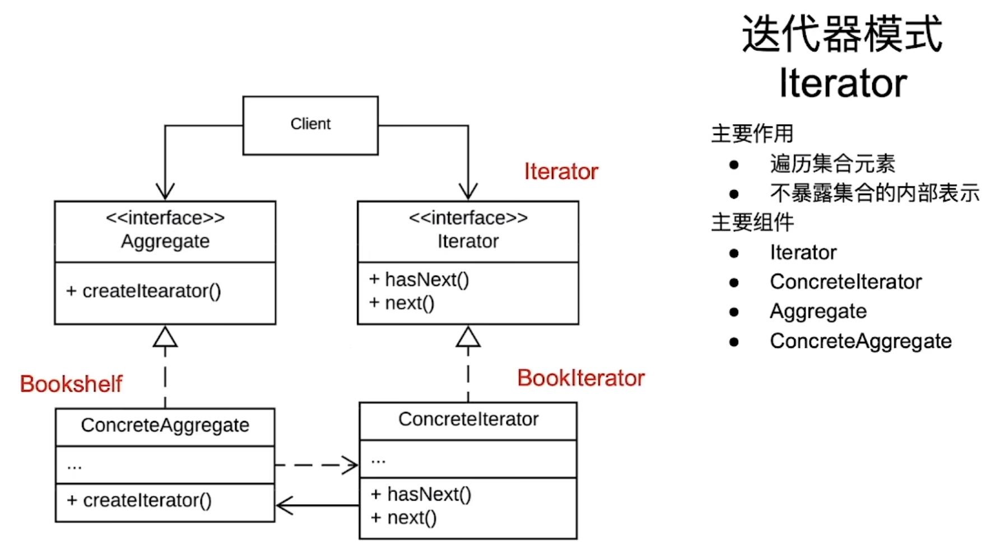

# 迭代器模式

一个专门用来遍历集合元素的模式

## 入门案例

书籍管理系统：添加书籍、遍历书籍的功能

### 代码

```java
/**
 * 书籍类
 * */
public class Book {
    private final String mBookTitle;

    public Book(String title) {
        mBookTitle = title;
    }

    public String getBookTitle() {
        return mBookTitle;
    }
}

/**
 * 书架类
 * */
public class BookShelf {
    private final ArrayList<Book> mBookList;

    public BookShelf() {
        mBookList = new ArrayList<>();
    }

    public void addBook(Book newBook) {
        mBookList.add(newBook);
    }

    public ArrayList getBookList() {
        return mBookList;
    }
}

/**
 * 客户端
 * */
public class Clinet {
    public static void main(String[] args) {
        BookShelf bookShelf = new BookShelf();

        bookShelf.addBook(new Book("哈利波特"));

        List<Book> bookList = bookShelf.getBookList();

        for(Book book: bookList) {
            sout(book.getBookTitle);
        }
    }
}
```

### 分析

显然，这种写法不符合开闭原则。因为当我们需要添加新的遍历书架的方法时，就要对书架类进行修改。比如：有的遍历需要按照书籍入库的时间进行排序，有的需要按照书名的字母顺序进行排序等等。

下面使用迭代器模式对这个例子进行改进

### 改进代码

```java
/**
 * 迭代器接口
 * */
public interface Iterator {
    boolean hasNext();
    Object next();
}

/**
 * 书籍类
 * */
public class Book {
    private final String mBookTitle;

    public Book(String title) {
        mBookTitle = title;
    }

    public String getBookTitle() {
        return mBookTitle;
    }
}

/**
 * 书架类
 * */
public class BookShelf {
    private final ArrayList<Book> mBookList;

    public BookShelf() {
        mBookList = new ArrayList<>();
    }

    public void addBook(Book newBook) {
        mBookList.add(newBook);
    }

    public Iterator getIterator() {
        return new BookIterator();
    }

    private class BookIterator implements Iterator {

        private int index = 0;

        @Override
        public boolean hasNext() {
            return index < mBookList.size();
        }

        @Override
        public OBject next() {
            if (hasNext()) {
                return mBookList.get(index++);
            }
            return null;
        }

    }
}

/**
 * 客户端类
 * */
public class Client {
    public static void main(String[] args) {
        BookShelf bs = new BookShelf();

        Book book1 = new Book("book1");
        Book book2 = new Book("book2");
        Book book3 = new Book("book3");
        Book book4 = new Book("book4");

        bs.addBook(book1);
        bs.addBook(book2);
        bs.addBook(book3);
        bs.addBook(book4);

        Iterator bi = bs.getIterator();
        while(bi.hasNext()) {
            Book book = bi.next();
            sout(book.getBookTitle());
        }
    }
}

```

### 分析

当我们需要增加一种新的排序方式时，不需要对原本数据的存储类进行过多的修改，只需增加一种迭代器的类型即可。甚至上述例子中，迭代器对象还可以作为一个接口的实现类抽离出来，用类似桥接模式的方式实现数据存储和数据迭代的功能分离。进一步使其解耦。

## 迭代器模式的架构和特点

### 架构



#### 组成成员

* Iterator: 迭代器抽象顶层接口，定义了遍历集合元素所需要的方法
* ConcreteIterator： 具体的迭代器实现对象，实现具体迭代方式的代码
* Aggregate: 聚合类的顶层接口,简单来说就是存放要迭代元素的地方
* ConcreteAggregate: 具体的聚合类的实现

### 特点

* 遍历集合元素
* 不暴露集合的内部表示

## 进阶案例

学生名单管理系统：目标是遍历班级中所有学生的信息，同时保证代码的模块化和易维护

### 代码

```java
/**
 * 迭代接口
 * */
public interface Iterator {
    boolean hasNext();

    Object next();
}

/**
 * 学生类(要遍历的实体类)
 * */
public class Student {
    private String mName;
    private int mAge;

    public Student(String name, int age) {
        mName = name;
        mAge = age;
    }

    public String getName() {
        return mName;
    }

    public int getAge() {
        return age;
    }

    public String getStudentInfo() {
        return mName + " is " + mAge + "years old.";
    }
}

/**
 * 抽象聚合类
 * */
public interface Agregate {
    Iterator createIterator();

    int getSize();

    Object getAtIndex(int index);
}

/**
 * 班级，具体的聚合类实现
 * */
public class ClassRoom implements Agregate {

    private List<Student> mStudentList;

    public ClassRoom() {
        mStudentList = new ArrayList<>();
    }

    public void addStudent(Student student) {
        mStudentList.add(student);
    }

    @Override
    public Iterator createIterator() {
        return new StuentIterator(this);
    }

    @Override
    public int getSize() {
        return mStudentList.size();
    }

    @Override
    public Object getAtIndex(int index) {
        if(index < 0 || index >= mStudentList.size()) {
            return null;
        }
        return mStudentList.get(index);
    }

}

/**
 * 学生迭代器，具体的迭代器。需要持有 具体聚合类 的引用
 * */
public class StuentIterator implements Iterator {
    
    private int index = 0;
    private Agregate mAgregate;

    public StuentIterator(Agregate agregate) {
        mAgregate = agregate;
    }

    @Override
    public boolean hasNext() {
        return index < mAgregate.getSize();
    }

    @Overrid
    public Object next() {
        if (hasNext()) {
            return mAgregate.getAtIndex(index++);
        }
        return null;
    }
}

/**
 * 客户端代码
 * */
public class Client {
    public static void main(String[] args) {
        ClassRoom classRoom = new ClassRoom();

        Student s1 = new Student("张三", 18);
        Student s2 = new Student("李四", 20);
        Student s3 = new Student("王五", 17);
        Student s4 = new Student("李九", 19);

        classRoom.addStudent(s1);
        classRoom.addStudent(s2);
        classRoom.addStudent(s3);
        classRoom.addStudent(s4);

        StuentIterator it = (StuentIterator)  classRoom.createIterator();

        while(it.hasNext()) {
            sout(it.next().getStudentInfo());
        }
    }
}
```

## 总结

提供一种遍历结合数据的方法，同时不暴露集合的内部表示。

### 优点

1. 抽象性
2. 简化客户端代码
3. 支持多种集合类型
4. 解耦

### 缺点

1. 代码复杂度增加
2. 性能开销

### 使用场景

1. 遍历不同类型的集合
2. 集合实现可能发生变化
3. 提供一致的遍历接口

### 应用案例

1. 数据库访问
2. 文件系统
3. 社交网络（朋友关系、消息列表等）

# [返回](第四章.md)